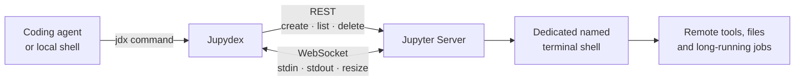

<p align="center">
  
</p>

<p align="center">
  <a href="https://github.com/Cambridger/jupydex/actions/workflows/ci.yml"></a>
  <a href="https://www.python.org/"></a>
  <a href="LICENSE"></a>
  <a href="https://github.com/Cambridger/jupydex/releases"></a>
  <a href="https://github.com/Cambridger/jupydex"></a>
</p>

<p align="center">
  <strong>A small, direct terminal bridge from coding agents to JupyterLab.</strong>
</p>

<p align="center">
  <a href="#quick-start">Quick start</a> ·
  <a href="docs/installation.md">Installation</a> ·
  <a href="docs/usage.md">Usage</a> ·
  <a href="docs/agent-integration.md">Agent integration</a> ·
  <a href="README.zh-CN.md">简体中文</a>
</p>

---

Jupydex lets Codex, scripts, and other coding agents operate a **dedicated
JupyterLab terminal directly**. It uses Jupyter Server's terminal REST API for
session management and its WebSocket channel for terminal input/output—no
browser automation, screenshots, or visual clicking.

```console
$ jdx exec -- python -V
{"ok":true,"result":{"terminal":"agent_shell","output":"Python 3.13.5","exit_code":0,"timed_out":false,"elapsed_seconds":0.39}}
```

> [!IMPORTANT]
> Jupydex is not an SSH server and adds no encryption or privilege boundary.
> Use Jupyter authentication together with HTTPS/WSS, a trusted VPN, or an SSH
> tunnel.

## Why Jupydex?

| | |
|---|---|
| **Direct** | Calls Jupyter Server directly instead of driving the web UI. |
| **Agent-friendly** | Every noninteractive command returns compact, parseable JSON. |
| **Persistent** | Reconnect to the same named shell and keep its environment and processes. |
| **Interactive** | Open an SSH-like local TTY and detach with `Ctrl-]`. |
| **Deliberate** | Never guesses a terminal, bulk-deletes sessions, or kills a process on timeout. |
| **Privacy-first** | Hides endpoints, paths, credentials, and executed commands from default diagnostics. |

## How it works



JupyterLab terminal sessions run on the Jupyter host with the permissions of
the Jupyter server account. Closing a browser tab does not necessarily stop
the underlying terminal, which is why Jupydex can reconnect to a named
session.

## Quick start

### 1. Install

The cleanest end-user installation is with
[`pipx`](https://pipx.pypa.io/):

```bash
pipx install git+https://github.com/Cambridger/jupydex.git
```

Or install into an existing virtual environment:

```bash
python -m pip install git+https://github.com/Cambridger/jupydex.git
```

Verify the command:

```bash
jdx --version
```

See the [installation guide](docs/installation.md) for `uv`, source checkouts,
upgrades, private CAs, SSH tunnels, and troubleshooting.

### 2. Configure privately

If the copied Jupyter URL contains a token, use the hidden interactive prompt:

```bash
jdx configure
```

If the URL has no credential, arguments are convenient:

```bash
jdx configure \
  --url 'https://jupyter.example/user/alice' \
  --terminal agent_shell \
  --cwd /workspace/project
```

The default config is saved at `~/.config/jupydex/config.json` with POSIX mode
`0600`. A token-bearing URL is rejected in `--url` because shell history and
process listings may retain command-line arguments.

### 3. Create a dedicated terminal

```bash
jdx create --name agent_shell --cwd /workspace/project
```

Terminal names may contain only ASCII letters, digits, and underscores.
Jupydex will not select one of somebody else's existing terminals.

### 4. Execute or attach

```bash
jdx exec -- pwd
jdx exec -- python -V
jdx exec --timeout 30 -- python train.py --dry-run
jdx exec --shell 'tail -n 100 service.log | grep -E "ERROR|Traceback"'
jdx shell
```

Inside `jdx shell`, press **`Ctrl-]`** to detach while leaving the remote shell
and its child processes running.

## Command map

| Command | Purpose | Mutates remote state? |
|---|---|---:|
| `jdx configure` | Save a private connection profile | Local config only |
| `jdx doctor` | Check authentication, API access, and transport safety | No |
| `jdx list` | List terminal sessions visible to the credential | No |
| `jdx create` | Create one named terminal | Yes |
| `jdx exec` | Run a command and capture output/exit status | Depends on command |
| `jdx shell` | Attach an interactive local TTY | Depends on input |
| `jdx watch` | Read recent/live terminal output | No |
| `jdx send` | Send text or a control key | Yes |
| `jdx interrupt` | Send `Ctrl-C` to the selected terminal | Yes |
| `jdx close --yes` | Delete the selected terminal session | Yes |

Run `jdx <command> --help` for every option.

## JSON behavior

Successful CLI calls use a stable top-level envelope:

```json
{
  "ok": true,
  "result": {
    "terminal": "agent_shell",
    "output": "ready",
    "exit_code": 0,
    "timed_out": false,
    "elapsed_seconds": 0.42
  }
}
```

Configuration and transport errors are printed to stderr:

```json
{
  "ok": false,
  "error": "AuthenticationError",
  "message": "Jupyter rejected authentication (403)"
}
```

A remote nonzero exit is stored in `result.exit_code`; it does not turn the
local `jdx` process into a transport failure. Agent integrations should parse
the JSON instead of relying only on `$?`. Full commands are omitted from JSON
unless `--show-command` is explicitly supplied.

See [Agent integration](docs/agent-integration.md) for `jq`, Python API, timeout
handling, and guardrails.

## Authentication and configuration

Jupydex supports:

- Jupyter token authentication;
- cookie authentication with `_xsrf` forwarding;
- JupyterHub base paths such as `/user/alice`;
- private certificate authorities;
- environment-variable overrides;
- an explicit WebSocket `Origin` override.

Environment variables take precedence over the saved profile:

| Variable | Meaning |
|---|---|
| `JUPYDEX_URL` | Jupyter Server base or copied Lab URL |
| `JUPYDEX_TOKEN` | Bearer token |
| `JUPYDEX_COOKIE` | Complete Cookie header |
| `JUPYDEX_TERMINAL` | Dedicated terminal name |
| `JUPYDEX_CWD` | Default remote working directory |
| `JUPYDEX_VERIFY_TLS` | `true` by default |
| `JUPYDEX_CA_BUNDLE` | Private CA certificate bundle |
| `JUPYDEX_ORIGIN` | WebSocket Origin override |
| `JUPYDEX_TIMEOUT` | HTTP/open timeout in seconds |
| `JUPYDEX_CONFIG` | Alternate config path; empty disables file loading |

See [`.env.example`](.env.example) for synthetic values. Never commit a real
`.env` file.

## Security model

Jupyter documents terminal WebSocket access as arbitrary shell execution. Treat
the credential as equivalent to shell access for that Jupyter account.

- Prefer a **dedicated, non-root OS account**.
- Prefer **HTTPS/WSS, VPN, or an SSH port forward**.
- Rotate any token exposed in chat, shell history, logs, screenshots, or Git.
- Keep TLS verification enabled; use `--ca-bundle` for a private CA.
- Use one dedicated terminal name per agent or workflow.
- A timeout does not kill a remote process unless
  `--interrupt-on-timeout` is explicitly used.
- `close` requires `--yes` and affects only the exact terminal name.

Read [SECURITY.md](SECURITY.md) before exposing Jupyter beyond loopback.
Relevant upstream references:
[Jupyter Server security](https://jupyter-server.readthedocs.io/en/stable/operators/security.html),
[public-server guidance](https://jupyter-server.readthedocs.io/en/stable/operators/public-server.html),
and [JupyterLab terminals](https://jupyterlab.readthedocs.io/en/stable/user/terminal.html).

## Documentation

| Guide | Contents |
|---|---|
| [Installation](docs/installation.md) | Install methods, server prerequisites, auth, SSH tunnel, upgrades |
| [Usage](docs/usage.md) | Complete command guide, examples, troubleshooting |
| [Agent integration](docs/agent-integration.md) | JSON contract, `jq`, Python API, operational guardrails |
| [Security policy](SECURITY.md) | Threat model, credential response, reporting |
| [中文说明](README.zh-CN.md) | 中文安装、配置与快速使用 |

## Development

```bash
git clone https://github.com/Cambridger/jupydex.git
cd jupydex
python -m venv .venv
source .venv/bin/activate
python -m pip install -e '.[dev]'
python -m unittest discover -s tests -v
python tools/check_release.py
python tools/check_links.py
python -m build
```

The test suite includes a real loopback WebSocket transport test but never
requires a private Jupyter server. Read [CONTRIBUTING.md](CONTRIBUTING.md)
before opening a pull request.

## Project status

Jupydex is an early-stage project. The public CLI is useful today, but backward
compatibility is not guaranteed until a `1.0.0` release. Please use
[issues](https://github.com/Cambridger/jupydex/issues) for reproducible bugs and
feature proposals.

## License

[MIT](LICENSE) © 2026 Jupydex contributors.
