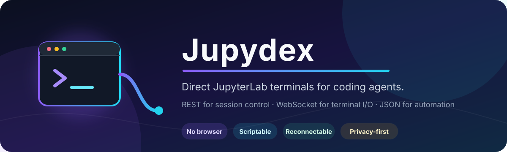

<p align="center">
  
</p>

<p align="center">
  <a href="https://github.com/Cambridger/jupydex/actions/workflows/ci.yml"></a>
  <a href="https://www.python.org/"></a>
  <a href="LICENSE"></a>
  <a href="https://github.com/Cambridger/jupydex/releases"></a>
</p>

<p align="center">
  <strong>让编程智能体直接、可编程地操作 JupyterLab 终端。</strong>
</p>

<p align="center">
  <a href="README.md">English</a> ·
  <a href="#快速开始">快速开始</a> ·
  <a href="docs/installation.md">安装详解</a> ·
  <a href="docs/usage.md">命令手册</a> ·
  <a href="docs/agent-integration.md">智能体集成</a>
</p>

---

Jupydex 是一个轻量级命令行网关，让 Codex、自动化脚本或其他编程智能体
直接连接专用的 JupyterLab 终端。它通过 Jupyter Server REST API 管理终端
会话，通过 WebSocket 发送输入并接收输出，不需要浏览器自动化、截图识别或
视觉点击。

```console
$ jdx exec -- python -V
{"ok":true,"result":{"terminal":"agent_shell","output":"Python 3.13.5","exit_code":0,"timed_out":false,"elapsed_seconds":0.39}}
```

> [!IMPORTANT]
> Jupydex 不是 SSH 服务，不会自行提供加密或权限隔离。请把它与 Jupyter
> 身份验证以及 HTTPS/WSS、可信 VPN 或 SSH 隧道配合使用。

## 核心能力

| 能力 | 说明 |
|---|---|
| 直接连接 | 调用 Jupyter Server，不操作网页 UI |
| 适合智能体 | 非交互命令统一返回可解析 JSON |
| 会话持久化 | 使用固定名称重连同一个 shell，保留环境和后台进程 |
| 交互终端 | 提供类似 SSH 的本地 TTY，按 `Ctrl-]` 安全脱离 |
| 安全边界明确 | 不猜测终端、不批量删除、超时默认不杀远程进程 |
| 默认脱敏 | 诊断结果隐藏地址、目录和凭据，执行结果默认不回显命令 |

## 工作原理


JupyterLab 终端在服务器端运行，并继承 Jupyter Server 进程的系统权限。
因此，对终端的访问应视为对该系统账户的 shell 访问。

## 快速开始

### 1. 安装

推荐使用 `pipx`，让命令行工具拥有独立环境：

```bash
pipx install git+https://github.com/Cambridger/jupydex.git
```

也可以安装到当前 Python 虚拟环境：

```bash
python -m pip install git+https://github.com/Cambridger/jupydex.git
```

确认安装：

```bash
jdx --version
```

更多方式见[安装指南](docs/installation.md)，包括 `uv`、源码安装、私有 CA、
SSH 隧道、升级和卸载。

### 2. 安全配置

如果复制的 JupyterLab 链接中含有 token，请使用隐藏输入：

```bash
jdx configure
```

如果 URL 本身不含凭据，可以直接使用参数：

```bash
jdx configure \
  --url 'https://jupyter.example/user/alice' \
  --terminal agent_shell \
  --cwd /workspace/project
```

配置默认保存在 `~/.config/jupydex/config.json`，权限为 `0600`。为了避免
token 进入 shell 历史或进程列表，Jupydex 会拒绝在 `--url` 中传入含 token
的地址。

### 3. 创建专用终端

```bash
jdx create --name agent_shell --cwd /workspace/project
```

终端名仅允许 ASCII 字母、数字和下划线。Jupydex 不会从已有会话中猜测一个
终端接管。

### 4. 执行命令

```bash
jdx exec -- pwd
jdx exec -- python -V
jdx exec --timeout 30 -- python train.py --dry-run
jdx exec --shell 'tail -n 100 service.log | grep -E "ERROR|Traceback"'
```

### 5. 进入交互终端

```bash
jdx shell
```

按 **`Ctrl-]`** 脱离连接，但不会停止远程 shell 或它启动的子进程。

## 命令速查

| 命令 | 用途 |
|---|---|
| `jdx configure` | 保存私人连接配置 |
| `jdx doctor` | 检查认证、API 和传输安全 |
| `jdx list` | 列出凭据可见的终端 |
| `jdx create` | 创建一个命名终端 |
| `jdx exec` | 执行命令并获取输出和退出码 |
| `jdx shell` | 进入交互式 TTY |
| `jdx watch` | 读取最近或实时终端输出 |
| `jdx send` | 发送文本或控制键 |
| `jdx interrupt` | 向指定终端发送 `Ctrl-C` |
| `jdx close --yes` | 删除指定终端会话 |

使用 `jdx <命令> --help` 查看完整参数。

## JSON 与退出码

远程命令的退出码位于 `result.exit_code`：

```json
{
  "ok": true,
  "result": {
    "terminal": "agent_shell",
    "output": "ready",
    "exit_code": 0,
    "timed_out": false,
    "elapsed_seconds": 0.42
  }
}
```

远程程序返回非零状态并不代表 Jupydex 传输失败，因此智能体应解析 JSON，
不要只检查本地 `$?`。执行的完整命令默认不会出现在 JSON 中；只有明确使用
`--show-command` 才会显示。

## 安全建议

- 使用专用的、非 root 系统账户运行 Jupyter。
- 优先使用 HTTPS/WSS、可信 VPN 或 SSH 端口转发。
- token 一旦出现在聊天、日志、截图、shell 历史或 Git 中，应立即轮换。
- 保持 TLS 证书校验；私有证书使用 `--ca-bundle`。
- 每个智能体或工作流使用独立终端名。
- 超时默认不会终止远程命令；只有 `--interrupt-on-timeout` 才发送 `Ctrl-C`。
- `close` 必须带 `--yes`，并且只删除精确指定的终端。

公开服务器前请完整阅读 [SECURITY.md](SECURITY.md)。

## 文档导航

| 文档 | 内容 |
|---|---|
| [安装指南](docs/installation.md) | 安装方式、服务器条件、认证、SSH 隧道、升级 |
| [使用手册](docs/usage.md) | 命令参数、示例、常见问题 |
| [智能体集成](docs/agent-integration.md) | JSON 契约、`jq`、Python API、操作护栏 |
| [安全策略](SECURITY.md) | 威胁模型、凭据泄露处置、安全报告 |
| [贡献指南](CONTRIBUTING.md) | 本地开发、测试和 Pull Request |

## 项目状态

Jupydex 目前处于早期阶段。CLI 已可使用，但在 `1.0.0` 之前不承诺完整的向后
兼容性。问题和功能建议请提交到
[GitHub Issues](https://github.com/Cambridger/jupydex/issues)。

## 许可证

[MIT](LICENSE) © 2026 Jupydex contributors.
